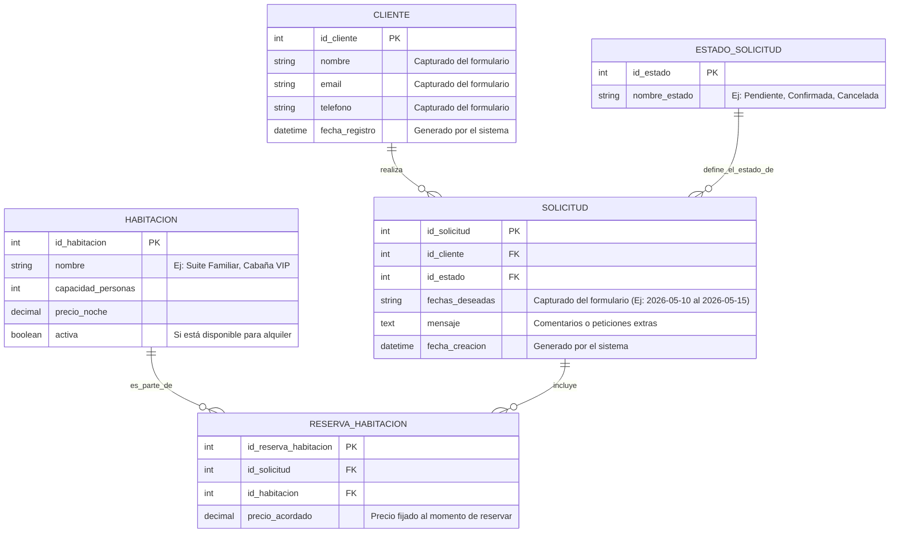

# 📊 Modelo de Datos (Diagrama Entidad-Relación)

Basado en el análisis de la página web del Hotel Campestre "Bruma Viva", el formulario de contacto y la lógica de negocio actual (que captura Nombre, Correo, Teléfono, Fechas y Mensaje), he diseñado el siguiente modelo de base de datos relacional.

Este modelo está preparado para ser implementado en motores SQL como PostgreSQL, MySQL o SQLite.

## Diagrama Entidad-Relación (ERD)

## 📖 Explicación de las Tablas (Entidades)

### 1. `CLIENTE`
Almacena la información de las personas que se contactan o se hospedan.
- Evita que dupliquemos datos si una persona hace varias reservas en el futuro.
- Se alimenta directamente de los campos `name`, `email` y `phone` de nuestro formulario.

### 2. `SOLICITUD` (o Reserva)
Es el corazón del sistema. Cada vez que alguien envía el formulario desde el frontend, se crea un registro aquí.
- Guarda las `fechas_deseadas` y el `mensaje` adicional.
- Está conectada al `CLIENTE` (sabiendo quién la pidió) y a un `ESTADO_SOLICITUD` (para saber si ya la atendimos).

### 3. `ESTADO_SOLICITUD`
Una tabla catálogo (o diccionario) muy simple.
- Sirve para que en el futuro los administradores del hotel puedan filtrar: "Muéstrame las solicitudes *Pendientes*" o "Muéstrame las *Confirmadas*".

### 4. `HABITACION`
Representa el inventario físico del hotel (las habitaciones que pusiste en el HTML con su scroll).
- Guarda el nombre, capacidad, precio base y si está activa o en mantenimiento.

### 5. `RESERVA_HABITACION` (Tabla Intermedia)
Como una Solicitud puede incluir varias habitaciones (ej. una familia grande) y una Habitación va a estar en muchas Solicitudes a lo largo del tiempo, esta tabla las conecta.
- Guarda el `precio_acordado` histórico por si en el futuro cambian los precios de las habitaciones, la reserva antigua no se vea afectada.

---
*Nota para el equipo: Este diseño es escalable. A futuro se pueden agregar tablas de `PAGOS`, `FACTURAS` o `SERVICIOS_EXTRA` conectándolas a la tabla `SOLICITUD`.*
